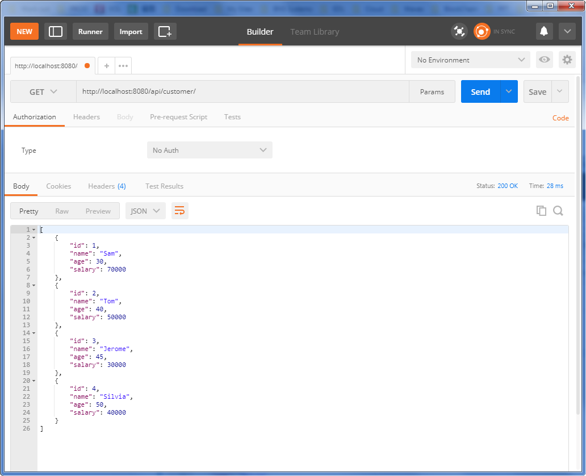
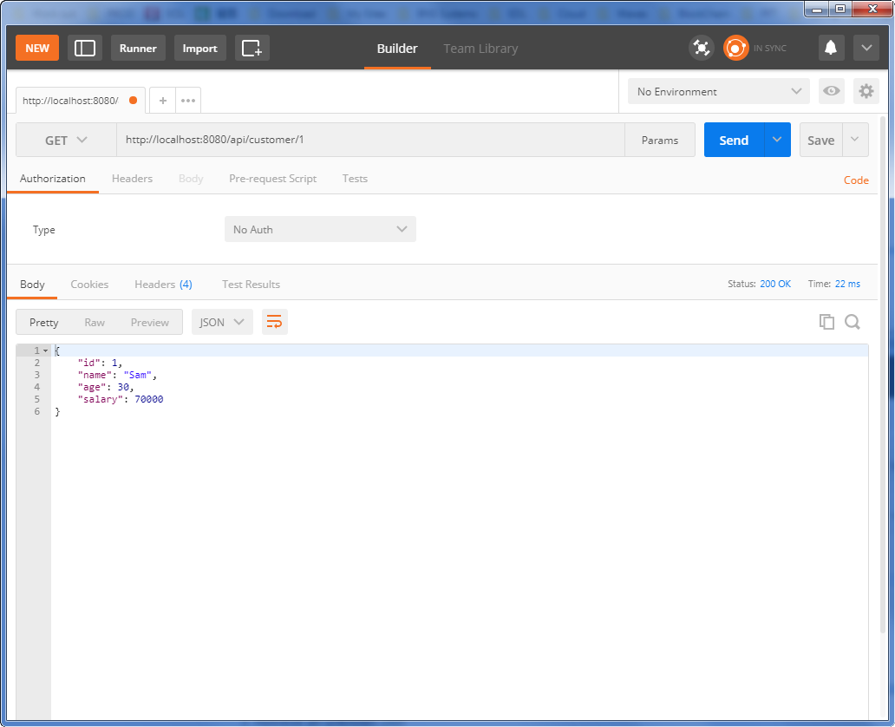
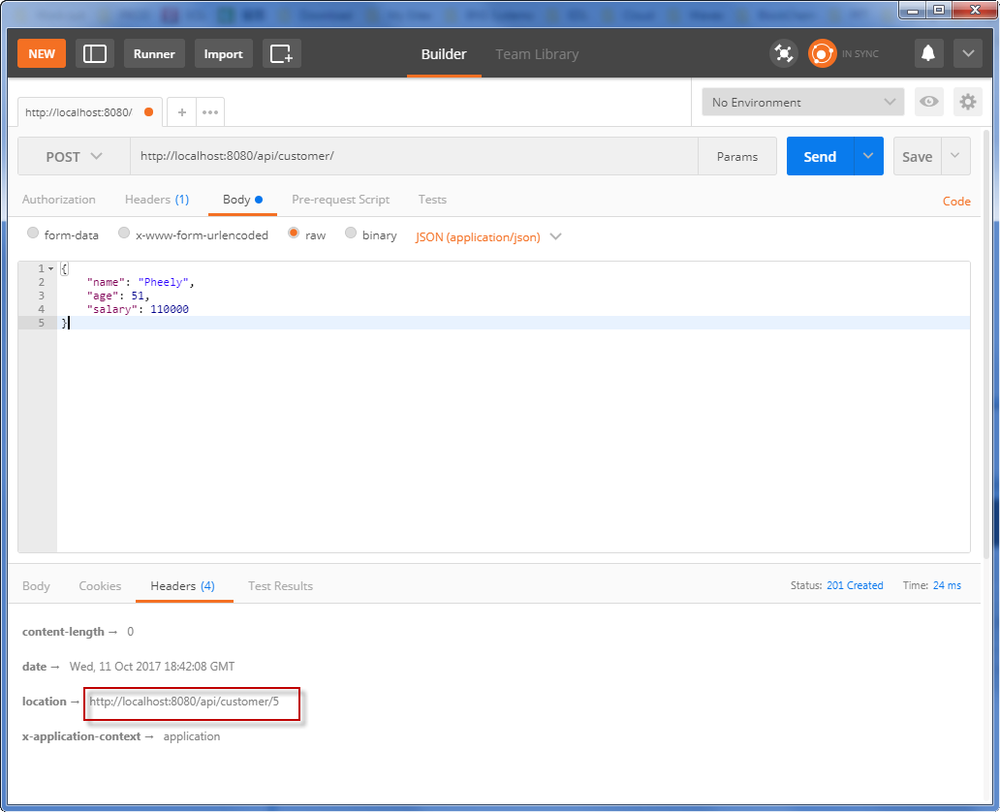
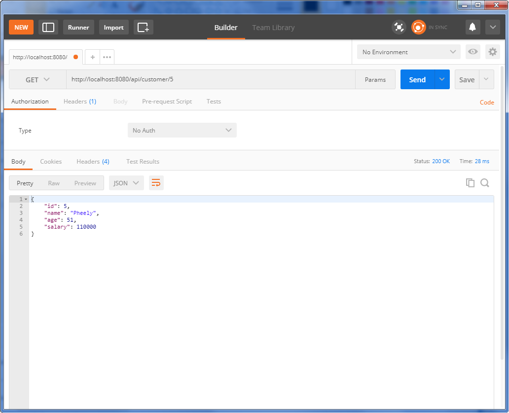
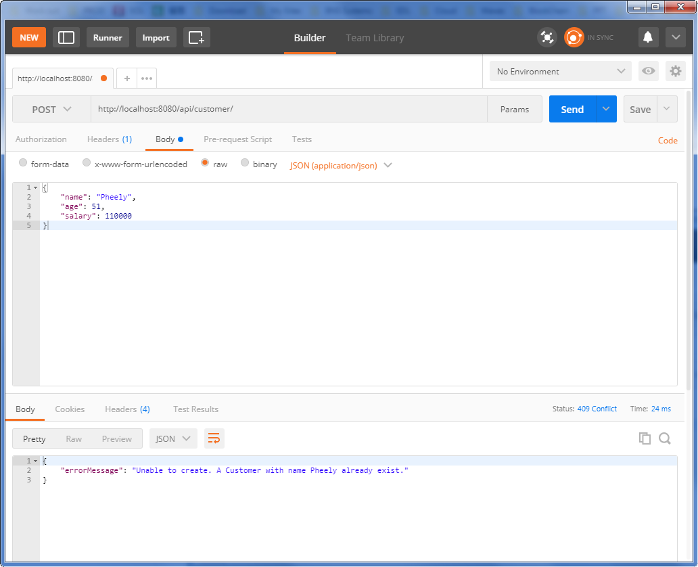
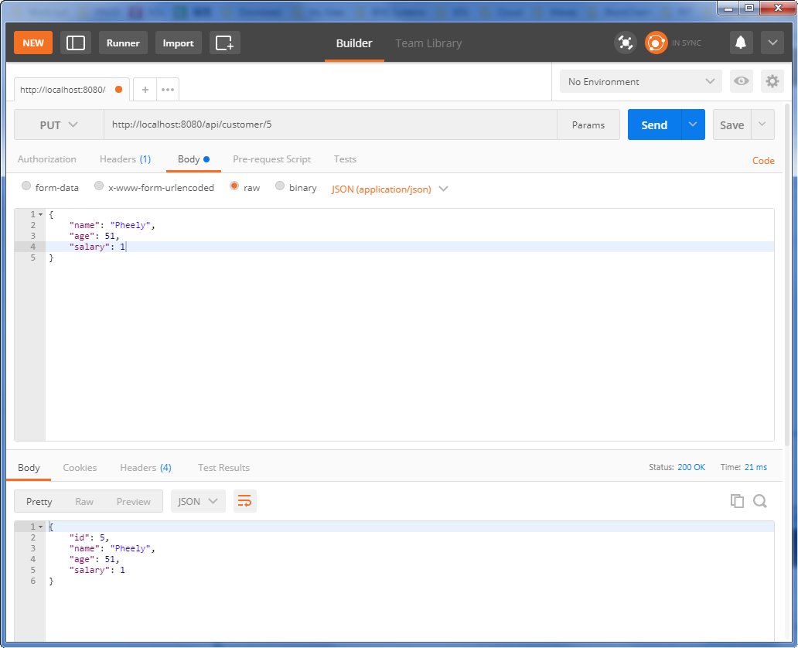
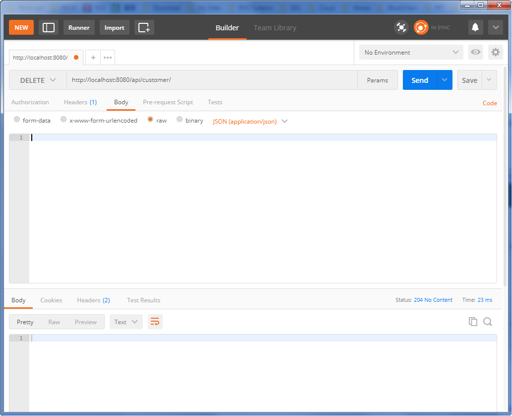

# Secured Customer Service

## Testing Unsecured Application in Postman

1. Retrieve all customers

2. Retrieve one customer

3. Retrieve an unknown customer

4. Create a customer

5. Verify the created customer

6. Create a duplicate customer

7. Update a customer

8. Delete a customer

9. Delete all customers

